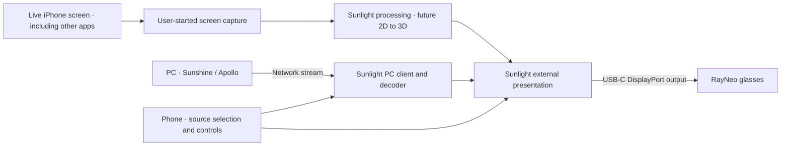

# Sunlight: connected AR glasses plan

> Historical research: the active direction is now [host streaming only](sunlight-host-streaming.md). LiveContainer and its binaries/resources were removed on 2026-09-07. Local iPhone hosting and client conversion are deferred until iOS 27 verification.

> Historical record: on 2026-09-05 the user selected [per-app 3D integration](sunlight-per-app-3d.md), with container hosting as one candidate. The background-output probes and their source projects have been removed. Previous findings and device log paths are retained as evidence; proposed experiments below are not the active implementation plan.

Date: 2026-09-04. Status: display foundation and standalone SBS calibration implemented and physically validated on the user's RayNeo glasses. The user passed the eye-label/color, alignment, swap, reconnect, and Stop checks. USB disconnection removes glasses power and resets them to normal 2D mode; manually re-enabling 3D after reconnection restores the SBS test. Live iPhone-screen mode remains blocked on establishing supported background processed output: both the app-owned-window and system-only AVPlayer tests returned to ordinary phone mirroring on Home/app switch. Reconnect stress testing and physical PC streaming validation remain.
Audited code baseline: Integration at a1de0a94.

## Intended experience

The user clarified that the primary source choices must be **PC** and **iPhone screen**. iPhone-screen mode must continue presenting other apps through Sunlight's custom glasses surface after Sunlight is minimized, providing the input path for future live 2D-to-3D conversion. The user explicitly does not want a video player inside Sunlight; local-file playback is out of scope. The current-platform facts and required feasibility test are tracked in [iPhone screen feasibility](sunlight-iphone-screen-feasibility.md).

Sunlight supports two complete operating modes. In standalone mode, the iPhone supplies content directly to its connected AR glasses with no PC, pairing, or host connection required. In PC streaming mode, Sunlight receives video from Sunshine/Apollo and presents it to the same glasses. The phone provides source selection and controls in both modes.

| Mode | Content path | Phone responsibility |
| --- | --- | --- |
| iPhone screen / standalone | Live iPhone screen capture → Sunlight processing/presentation → USB-C → glasses | Own capture, processing, source selection, and presentation across app switches. |
| PC streaming / passthrough | Sunshine/Apollo → network → Sunlight → USB-C → glasses | Receive and decode the PC stream, present it, and send input back to the PC. |

“Passthrough” describes the user's experience: the iPhone bridges the PC stream to the glasses. The existing client still decodes video for display. Both modes support ordinary 2D and, after stereo validation, SBS content.

The first milestone is: **with Sunlight open, plugging in the glasses automatically shows a dedicated Sunlight readiness screen in the glasses, before connecting to any PC.** Opening Sunlight with glasses already connected must produce the same result. This validates the shared display foundation; standalone content use is a separate required delivery beyond the readiness screen.

The first standalone workload is the live iPhone screen, including the Home Screen and other apps. Do not add a file picker, media library, or video playback controls as a substitute. First prove capture and custom external presentation continue together while Sunlight is minimized, then insert 2D-to-3D processing into that verified path.

For this design, “virtual screen” means Sunlight's own presentation surface on the connected display. iOS supplies the hardware display and scene; Sunlight supplies its window and content. A PC-style virtual monitor driver, a network streaming server on iPhone, and a screen anchored in physical space are separate projects. Head tracking is a later extension if the glasses expose a usable iOS interface. [Apple UIScreen documentation](https://developer.apple.com/documentation/uikit/uiscreen)

## Confirmed setup and remaining checks

- User's setup: iPhone 17 Pro, RayNeo glasses, direct USB-C.
- iPhone 17 Pro supports DisplayPort over USB-C. Use the glasses' video-capable cable. Actual glasses modes still require a hardware check. [Apple specifications](https://support.apple.com/en-us/125090)
- Record the exact RayNeo model, firmware, and phone iOS version at the first device test. Do not infer the glasses model from its resolution.
- Local tools currently report Xcode 26.6 and iPhoneOS SDK 26.5; the app's deployment target is iOS 12. Keep older supported paths working when introducing newer APIs.
- RayNeo's Air 2s documentation describes 3840 × 1080 full SBS and manual 2D/3D switching on iPhone. Treat this as a candidate contract to verify on this particular pair of glasses. A public API for automatic iOS mode switching has not been established. [Full SBS guide](https://www.rayneo.com/pages/watch-3d-video), [iOS instructions](https://www.rayneo.com/pages/rayneo-xr-app-ios)

## What the current app already provides

| Area | Evidence at the baseline | Planning implication |
| --- | --- | --- |
| External scene configuration | `VoidLink/Limelight-Info.plist:71` declares application and external display scenes. | Extend existing support. |
| Configuration selection | `VoidLink/AppDelegate.m:32` always requests “Default Configuration”; the external manifest entry has a different name. | Make configuration selection explicit and consistent for supported OS versions. |
| External window | `VoidLink/SceneDelegate.m:29` creates a black external window, but only the render-view setter at line 47 makes it visible. | Show an independent idle surface as soon as the scene is ready, including both connection orderings. |
| Ownership and cleanup | `VoidLink/SceneDelegate.m:7` uses static window/view references; line 63 schedules removal while clearing shared state. | Serialize ownership and transitions on the main thread and retain the specific view being detached. |
| Stream routing | `VoidLink/ViewControllers/StreamFrameViewController.m:706` and line 1470 attach video on appearance/connect and restore it on disconnect. | Separate display lifetime from stream lifetime. Avoid global screen-count assumptions as routing authority. |
| Metal routing | `VoidLink/ViewControllers/StreamFrameViewController.m:1021` inserts the Metal view directly into the phone controller, while the external route moves `_streamVideoRenderView`. | Route the actual selected renderer through one presentation interface. |
| Geometry | `VoidLink/Metal/MetalVideoRenderer.m:537` fits the whole decoded frame into a drawable. | Add explicit stereo layout and destination geometry before supporting arbitrary SBS sources. |

These are source findings and risks to verify, not results from a connected-glasses test.

## Implementation sequence

### 1. Establish the physical display connection

During the first authorized build-and-test run, capture scene connection events and the observed display properties: session role, bounds in points, native/current mode in pixels, scale, available modes, and reported maximum refresh rate. Keep reported limits distinct from measured presentation rate.

Use wireless device debugging while the USB-C port is occupied by the glasses. Capture the console live, preserve its file path in the test notes, and redact pairing secrets and session keys. Do not restart an existing app just to inspect its state.

Start with the glasses in their normal 2D mode. If no external display appears, resolve the cable, power, glasses mode, or OS issue before changing the video pipeline. Confirm ordinary video output on the same hardware when needed.

**Exit condition:** an OS external-display scene is observed on the actual iPhone/glasses combination, and its usable 2D mode is recorded.

### 2. Automatically create the Sunlight readiness screen

Introduce an external-display coordinator and a dedicated presentation controller. Keep the coordinator independent of PC discovery, pairing, and streaming. Let the external scene own its window; the coordinator tracks its availability and the content requested for it.

Define a presentation-source interface for local content and PC video. A source supplies content and its 2D/SBS layout; the presentation layer owns the destination. Local content must work without creating a `StreamManager`, `StreamFrameViewController`, or PC connection. Separate display connection state, selected content source, and stereo output mode.

Use the noninteractive external-display scene for fullscreen presentation. Match the supported OS's registration and configuration requirements. Apple's current guide specifies scene-accessory registration beginning in iOS 27; earlier releases use automatic scene connection. Implement against the confirmed device OS and available SDK, with an explicit iOS 27 compatibility task when adopting that SDK. [Apple connected-display guide](https://developer.apple.com/documentation/uikit/presenting-content-on-a-connected-display)

Show a visible, low-brightness “Sunlight ready” screen with a simple border/grid for checking orientation and clipping. Keep the phone's normal interface usable. Phone status can say “External display connected”; identifying the RayNeo model is optional diagnostic information, not a prerequisite for output.

Offer automatic external presentation by default while preserving an existing explicit Disabled setting. Reuse or clarify the current external-display setting, whose “AirPlay” implementation also handles wired displays.

**Exit condition:** plugging in glasses with Sunlight open, or opening Sunlight with glasses attached, shows the readiness screen without a PC, stream, restart, or manual display selection.

### 3. Make connection and presentation transitions reliable

Use explicit states such as disconnected, connecting, ready, presenting, and suspended. Track stereo-mode compatibility separately. The selected scene and its screen determine the output target; do not select `UIScreen.screens.lastObject` or use a render view's hidden flag as proof of routing.

Handle disconnect/reconnect, scene activation, display-mode changes, and phone rotation. Bind cleanup to the scene that disconnected so a delayed callback cannot remove content from a newer scene. Maintain a pending presentation request when the content becomes ready before the display.

Glasses reconnect must not restart the selected content session unnecessarily. For iPhone-screen mode, preserve the selected source and restore presentation when the capture session and compatible output are available. When a PC stream is attached, glasses unplug should restore usable phone presentation and controls without ending the PC session. Ending or losing a PC stream should return to source selection; it must not silently start screen capture. Background continuity is a required iPhone-screen acceptance condition, beyond the already validated foreground calibration foundation. Phone locking behavior must be measured separately.

Allow only one active content source to own the presentation surface. During a local/PC switch, stop the previous source's frame delivery before attaching the next source. Reject late callbacks or frames from the retired session so they cannot overwrite the newly selected content.

**Exit condition:** both connection orderings and repeated unplug/replug work without duplicate windows, lost views, stale black output, or crashes. Automated checks should target event-order and ownership races; device tests establish physical output behavior.

### 4. Prove SBS output with a local test pattern

Before involving the network, render a synthetic stereo image with distinct LEFT/RIGHT labels, a grid, circles, and a center alignment target. Support normal 2D and full SBS explicitly. Keep frame packing, eye order, per-eye aspect ratio, and physical display mode as distinct properties.

Implemented: the phone's **Glasses** panel provides connection status, **Start/Stop SBS test**, and **Swap eyes** without a PC session. Start queues a request until the connected window exposes the verified 3840 × 1080 mode with matching drawable dimensions. The pattern splits the canvas into two 1920 × 1080 images with identical, zero-disparity circle/grid geometry and distinct LEFT/green and RIGHT/cyan labels. Swapping exchanges complete eye images. The request and eye order survive display reconnects and 2D/3D transitions within the app session. Done dismisses the controls while output continues. A PC render request cancels calibration and takes over; calibration cannot displace an existing PC source.

Use the model's documented hardware control to enter 3D mode initially. Re-read scene geometry and available modes after the transition. The candidate full-SBS target is 3840 × 1080, containing two 1920 × 1080 eye images; use it only if the actual connection exposes a compatible mode. Do not infer stereo capability from an ultrawide resolution alone.

Check one eye at a time: each eye must see its intended label and an undistorted circle. Verify borders and eye alignment with no unintended crop, stretch, or phone overlays. If a compatible stereo mode is unavailable, report that status on the phone and retain a working 2D path.

**Exit condition:** correct physical eye separation is verified on the user's glasses, and switching between 2D and SBS recovers reliably.

Physical result: the user confirmed all seven calibration checks passed, including left/right labels and colors, round aligned circles and visible borders, eye swapping, reconnect recovery, and Stop returning to readiness. USB disconnection removes power from these glasses and resets their hardware mode to normal 2D; after reconnection, manually re-enabling 3D restores the requested SBS test. This passes the initial physical SBS milestone with manual hardware-mode selection. Extended reconnect/mode-switch stress testing remains separate. The earlier report of no different colors was resolved by tapping Start SBS test; no rendering change was needed.

### 5. Mirror the live iPhone screen without a PC

Offer **PC** and **iPhone screen** as explicit source choices when the glasses are connected. iPhone-screen mode starts capture using Apple's visible system screen-sharing/broadcast control. Feed live captured frames through Sunlight's processing and external presentation path. Keep start/stop and source controls on the phone. No local-file video player is part of this mode.

On the current iOS 26.6.1 device, ReplayKit broadcast extensions are the candidate for cross-app capture. Capturing frames and maintaining a visible, updating external surface while the containing app is backgrounded are distinct requirements. Apple's iOS 27 ScreenCaptureKit path is a future candidate; it also requires new external-scene registration and physical validation. Follow the [feasibility record](sunlight-iphone-screen-feasibility.md) before declaring this path supported. Ordinary system mirroring does not expose a Sunlight processing stage.

Physical feasibility status: both AVPlayer output probes failed background continuity on the current device. Removing Sunlight's external window did not produce system video takeover. Do not promise this source in the UI or treat capture implementation as a completed path until a supported background-output mechanism is identified and verified. An OS upgrade is not an established fix.

The user also requested the Windows-style offscreen/source plus topmost-presenter experiment. A direct Metal probe successfully submitted and completed the 1920 × 1080 source → 3840 × 1080 SBS drawable pipeline in a separate window at level 2001. On Home the user again saw the glasses follow the phone. This independently tested the rendering/raised-window variation and did not establish persistent output. iPhone's app-owned offscreen texture is not a SudoVDA system virtual monitor.

**Exit condition:** with no PC, the user starts iPhone-screen mode, switches to the Home Screen and another app, and sees those live frames continuously through Sunlight's custom glasses surface. Stop capture and reconnect behave correctly. Once this is established, add 2D-to-3D conversion before SBS output and validate latency, per-eye geometry, and resource use on the same path.

### 6. Feed PC video into the same presentation surface

Provide one routing interface for the actual Metal or AVSampleBuffer renderer. Update view-controller ownership, destination pixel dimensions, scale, frame pacing, and color handling using the output display. Retain phone controls independently from the video surface.

Validate ordinary PC streaming to the glasses first. Then present known full-SBS content through the same path. Prefer decoding once and presenting directly, without another video encode/decode stage on the phone. Begin with SDR and a supported 60 Hz mode; evaluate higher refresh rates and HDR after the basic route works.

For Sunshine 3D host-generated stereo, audit the host capability and launch/resume contract before implementation. Upstream Sunshine and different Apollo variants must remain usable as ordinary 2D hosts. Only request host SBS from a host that advertises the matching capability. Stream metadata or an explicit user choice must identify SBS; a wide video frame alone is insufficient.

Start with exact full-SBS passthrough. Handle half-SBS conversion, eye swapping, and a single-eye phone preview as follow-up work if needed. Map phone pointer input to the logical PC desktop, not blindly to the double-width packed stereo frame.

Keep one consumer of the existing decoded-frame queue. A future phone preview needs deliberate frame sharing; adding another independently dequeuing renderer would make the two outputs compete for frames.

**Exit condition:** PC video appears in the glasses, controls work on the phone, full-SBS eyes remain correct, and host disconnect, stream stop, and glasses reconnect produce the documented fallback behavior. Switching between standalone and PC mode retains the display surface and leaves only the selected source presenting.

## Device acceptance checklist

| Scenario | Expected evidence |
| --- | --- |
| No glasses | Normal Sunlight operation. |
| Glasses connected before launch | Readiness screen appears automatically. |
| Glasses connected while browsing hosts | Readiness screen appears; phone remains usable. |
| iPhone source with no PC | Live screen capture works without a PC session. |
| Sunlight minimized; Home Screen and another app used | Fresh captured frames continue through Sunlight's external presentation surface. |
| Glasses unplug/replug during iPhone capture | Selected source is retained; output recovers after re-enabling hardware 3D as needed. |
| Ten unplug/replug cycles | One active external presentation, consistent cleanup, no crash. |
| Phone rotation | Glasses content keeps the correct orientation and geometry. |
| Background/foreground and lock/unlock | Observed suspension/recovery is recorded; no stale ownership on return. |
| Glasses 2D/3D transition | Mode changes are observed and layout is rebuilt or a clear unsupported-mode state is shown. |
| Synthetic SBS | Physical LEFT/RIGHT eye check passes; circles stay circular. |
| Stream starts before/after glasses connect | Selected renderer reaches the same external surface. |
| Glasses unplug during stream | Phone presentation and input recover without quitting the PC app. |
| Standalone → PC → standalone | Source changes without recreating the display session; no stale frames from the previous source. |
| Stream ends or PC becomes unavailable | Source selection returns; screen capture does not start without user action. |

Physical display negotiation and eye separation require real hardware; simulator checks cannot establish those results. A later streaming soak should measure frame pacing, latency, heat, power use, and audio routing.

## Work boundaries and first delivery

Implement in this iOS repository. `/Volumes/Data/repos/Apollo-3D` and `/Volumes/Data/repos/moonlight-android` remain read-only references; document any required host changes for the user to make on the host machine. The host's Windows virtual-display and RayNeo HID implementation is reference material, not an iOS implementation strategy.

The first implementation delivery comprises steps 1–3: automatic external-screen detection, an independent visible readiness screen, reliable lifecycle handling, and a device test record with the live-log capture path. The next delivery proves SBS and makes standalone content useful (steps 4–5). PC passthrough is the other required operating mode (step 6), using the same presentation foundation.

Implementation now includes the independent readiness controller, display coordinator, corrected external scene registration, shared routing for existing Metal/AVSampleBuffer video, and physically validated standalone SBS calibration with phone controls. Device builds, simulator lifecycle checks, and the user's physical test results are documented in [the validation record](sunlight-ar-glasses-validation.md). Live iPhone-screen capture with background external output, physical PC streaming validation, and extended transition stress testing remain. The canceled local-video implementation was removed. No host repository changes or remote publication are part of this delivery.
