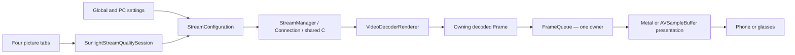

# iOS review and Client 3D base

September 9, 2026. This pass reviewed the app's streaming lifecycle, decode and
presentation path, input/microphone/haptics, discovery/pairing/HTTP, settings
ownership, navigation, startup, and project source inventory. It preserves the
existing dirty Integration worktree; it is not a reset to upstream. No host,
Android or shared common-C source was changed.

## Findings addressed

| Area | Problem | Result |
| --- | --- | --- |
| Pairing and TLS | Host-controlled lengths and malformed certificates could crash; missing client credentials and pin mismatches were not consistently rejected. | Validate before decrypting/slicing/importing; require the paired certificate; safely reject missing credentials. |
| HTTP and discovery | XML diagnostics could echo secrets; malformed app-list refresh retained success; mixed address families skipped valid candidates. | Payload-free parse errors, DTD rejection, shared status validation and complete address filtering. |
| Decoder metadata | Queued decoded output could read a replaced format description. | Each decoded Frame owns its pixel buffer and matching format before queue handoff. |
| Presentation lifetime | Layout reset decoder state; delayed interpolation and requeue work could affect a successor. | Keep layout independent from decoder reset; reject retired producer work. |
| Interpolation | Slow GPU processing accumulated decoded buffers; stale results/HUD could reach later presentation. | Bound waiting frames, drop retired/out-of-order results, and bind notifications to the original producer. |
| Frame consumption | Paused Metal output could spin; timeout dequeue did not track cancellation/queue replacement. | Semaphore-based waiting with cancellation and owner checks. |
| Audio shutdown | A stalled SDL output queue could keep the audio callback waiting during disconnect. | Owner-driven atomic cancellation exits the drain wait before cleanup joins the callback. |
| Statistics | Raw memory copies bypassed ownership of a string inside the stats struct; reads could cross sessions. | Use typed copies/resets and hold session ownership through snapshot enrichment. |
| Haptics | Effects and engine callbacks raced; phone fallback engines missed cleanup. | Serialize effect/reset/cleanup, drain teardown and clean both physical and phone engines. |
| Session input | Delayed controller feedback, gyro setup and dummy input could outlive their owner. | Route feedback on main with retirement checks; copy trigger payloads; gate delayed input and gyro work. |
| Quit action | A delayed shortcut resolved whichever app was launched later. | Capture the exact app/session, wait for stream teardown, reject changed launch/session identity. |
| Streaming controller | Per-mode drafts, reset markers, geometry and persistence lived in the view controller. | Extract SunlightStreamQualitySession; immutable commit actions survive panel teardown. |
| Settings | Cancelled/dismissed PC forms still accepted retained actions; completed migration crossed queues repeatedly. | Retire form callbacks and skip completed migration work before UIKit/store access. |
| Browser | Layout created full artwork views just to measure; host-grid height constraints conflicted or remained stale. | Read shared card geometry; keep UIKit's contentView; use content height with a safe-area upper bound. |
| Startup | Database-open errors deleted the store and retried recursively. | Preserve the database, gate application services/UI, and show a Retry screen. |
| Dead code | Retired setup screens, duplicate source trees and private microphone playback experiments obscured current behavior. | Remove unreachable code and stale project references; retain useful persistence tests under their current responsibility. |
| UI branding | Translated tips, onboarding, permission prompts and system-name fallbacks still identified the app as VoidLink. | Use Sunlight 3D across displayed copy; describe PC streaming in About, remove the upstream registration banner, and make the legacy watermark plain branding. Keep internal IDs, copyright credit and valid upstream links. |

Crypto, network and haptic details are in the ignored review evidence directory
`build/host-streaming-cleanup/input-network-20260909/`. Consolidated build and
verification evidence is recorded under `build/ios-review-20260909/`.

## Current responsibilities

- `MainFrameViewController` owns app selection and accepted launch/reconnect/quit
  transitions. `StreamConfiguration` freezes the negotiated source and codec
  constraints. A live settings view cannot rewrite that transport snapshot.
- `SunlightStreamQualitySession` owns one app's mode baselines, staged edits and
  reset intent. The controller captures the selected commit before teardown;
  only an accepted reconnect invokes it. Other tabs receive detached handoff
  copies. Closing the panel discards unsaved edits.
- `ConnectionLifecycle` owns the shared transport lifetime. Video, microphone,
  touch and controller work must remain tied to that session through final
  delivery. Cleanup must finish before a successor uses shared resources.
- `VideoDecoderRenderer` owns decoder state and produces a Frame whose image and
  metadata have matching lifetimes. Presentation layout cannot invalidate the
  decoder merely because the phone/glasses view moved or resized.
- `FrameQueue` is a bounded presentation handoff with a single active owner.
  The existing optional frame interpolation path is separate from depth
  conversion and must not create another consumer of the decoded queue.
- `ExternalDisplayCoordinator` owns display routing and settled glasses geometry.
  It does not choose or configure a depth model. Native refers to the phone/tablet;
  Raw refers to the exact glasses canvas.

## Client 3D work can start from these boundaries

Client 3D remains disabled. No placeholder model, speculative iOS 27 API, local
screen capture or extra decoder consumer was added.

The processing boundary is the owned decoded Frame before presentation enqueue.
A future depth processor should consume that frame and publish its own retained
output only while its session remains active. It needs bounded pending work,
explicit cancellation, source/metadata matching and a known output layout.
GPU completion after teardown must release its resources without publishing.
Avoid CPU image readbacks and competing queue consumers as the default design.

Keep the incoming 2D source geometry separate from processed SBS output geometry.
Enabling client conversion must not request host conversion. The existing
Host 3D and Raw contracts remain independent. Add the supported Client 3D mode
explicitly to mode policy, quality state, presentation and tests after platform
verification, then enable its existing UI tab. Do not infer support from enum
ordering or glasses width alone.

The shared published C revision already provides microphone, authored haptics,
atomic presentation V2 and telemetry APIs. Adopting live host mode changes still
needs an iOS presentation transaction; it does not require another local fork.
See [the streaming contract](sunlight-host-streaming-contract.md).

## Verification and limits

Final combined validation:

| Check | Result |
| --- | --- |
| Core regression entry point | All 26 suites passed. |
| UIKit/simulator regression entry point | All 7 suites passed: display 46, persistence 84, startup recovery 20, picture/PC controls 576, control pad 1,050, relative touch 8, browser 40. |
| Signed Debug iOS build | Passed; strict deep code-signature verification passed. This binary was not installed on a physical device. |
| Full simulator app build and startup | Passed on fresh iPhone 17 Pro and iPad Pro 11-inch simulators, iOS 26.5. Both loaded their storyboard and machine browser, with first-launch information shown. The iPhone was also inspected after dismissing the information page. |
| Xcode static analysis | Passed with zero app-owned diagnostics after fixes. Seventeen shared-core and nineteen bundled ImGui diagnostics remain; they are not all confirmed defects. |
| Sanitizers | Targeted crypto, decoder, haptic, input, audio and statistics checks passed their documented ASan/UBSan or TSan runs. |

Build logs, source/binary checksums, final suite summaries, analyzer diagnostics,
redacted startup console captures and screenshots are in
`build/ios-review-20260909/`. Temporary simulators were deleted after capture.
The final core run supersedes an earlier run that caught missing noescape
annotations on method definitions and an in-progress test's weak-reference
declaration error; both were corrected before the final pass.

The subsequent UI branding follow-up has its build and packaged-localization
checks in `build/ios-review-20260909/branding/`. All four shipped languages were
checked for old product-name text, including English fallback values and system
permission messages. Existing upstream URL destinations were preserved. This
copy-only follow-up did not change streaming, input or persistence logic.

The regression entry points are documented in [tests/README.md](../tests/README.md).
Tests use real production code with controlled transport, scheduling, crypto and
GPU boundaries, plus isolated UIKit/Core Data/Metal simulator runs. Device logs
from the previous installed revision verified native 2622 × 1206 streaming; that
observation must not be attributed to a later binary without another device run.

A code review and sanitizer checks do not prove physical glasses alignment,
sustained thermal performance, all controllers, microphone sound, every OS
version, or future Client 3D conversion quality. Raw SBS remains user-verified;
this review does not repeat that physical test.

The inherited settings/widget editors and navigation bridge remain large. They
still serve saved profiles and storyboard integration, so this pass removes
proven dead paths rather than rewriting them wholesale. Further module splits
can be done independently of the decoded-frame boundary. Existing platform
availability/deprecation warnings are not claims of modern-OS-only support.
The inherited first-launch About/controller-hint UI remains. The iPhone locks
landscape, while iPad retains its existing resizable-window/orientation behavior;
this review does not introduce an iPad full-screen orientation restriction.

Static analysis also reached shared common-C and bundled ImGui. Those findings
are not all verified defects. A duplicate RTSP header allocation leak in the
published common-C revision was reproduced; the
[handoff for the other machine](shared-common-core-review-20260909.md) documents
the trigger, ownership fix and regression to add. The dependency remains clean
and unchanged in this pass.

This reviewed baseline belongs to the iOS repository together with its clean
published shared-core pin. The sibling host and Android projects remain separate
and unchanged by this review.
